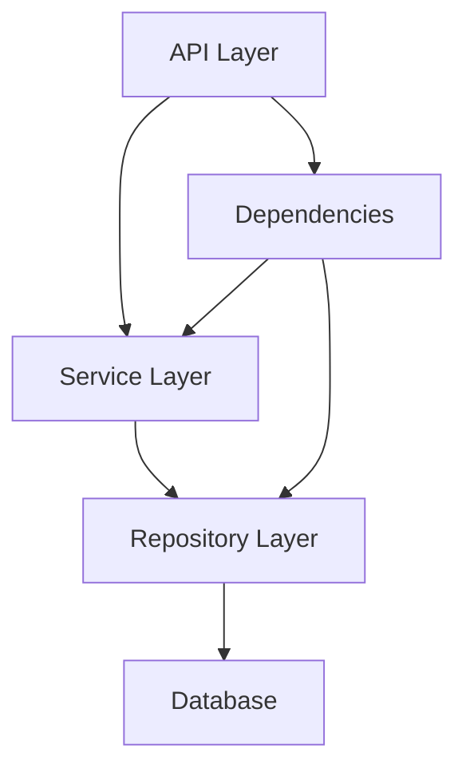

# Architecture Document

This document outlines the architecture of the FastAPI project, its design principles, and the patterns used.

## Core Principles

-   **Separation of Concerns (SoC)**: The project is divided into distinct layers, each with a specific responsibility. This makes the codebase easier to understand, maintain, and test.
-   **Dependency Inversion Principle (DIP)**: High-level modules (business logic) do not depend on low-level modules (data access). Both depend on abstractions. This is achieved through FastAPI's dependency injection and the Repository pattern.
-   **Type Hinting**: Strict type hinting is used throughout the codebase to improve code clarity, catch errors early, and enhance developer tooling.

## Layered Architecture

The application is structured into the following layers:

1.  **API Layer (`app/api`)**:
    *   **Responsibility**: Handles HTTP requests and responses. It's the entry point of the application.
    *   **Components**: FastAPI routers and endpoints.
    *   **Details**: This layer is responsible for parsing and validating incoming data (using Pydantic schemas), authenticating requests, and serializing the data for the response. It delegates all business logic to the Service Layer.

2.  **Service Layer (`app/services`)**:
    *   **Responsibility**: Contains the core business logic of the application.
    *   **Components**: Plain Python classes or functions.
    *   **Details**: Services orchestrate the application's operations. They are framework-independent and should not have any knowledge of HTTP requests or responses. They interact with the Repository Layer to access and persist data.

3.  **Repository Layer (`app/db/repository`)**:
    *   **Responsibility**: Abstracts the data source. It provides a clean API for the Service Layer to query and manipulate data without knowing the underlying database technology.
    *   **Components**: Repository classes.
    *   **Details**: Implements the Repository pattern. Each repository is responsible for a specific domain model (e.g., `UserRepository`).

## Technology Stack

-   **Framework**: [FastAPI](https://fastapi.tiangolo.com/)
-   **ORM**: [SQLAlchemy](https://www.sqlalchemy.org/)
-   **Database Migrations**: [Alembic](https://alembic.sqlalchemy.org/)
-   **Data Validation**: [Pydantic](https://pydantic-docs.helpmanual.io/)
-   **Testing**: [Pytest](https://docs.pytest.org/)

## Configuration

Configuration is managed via environment variables, loaded and validated at startup by Pydantic's `BaseSettings` in `app/core/config.py`. This ensures that the application is configured correctly for the environment it's running in (development, testing, production).